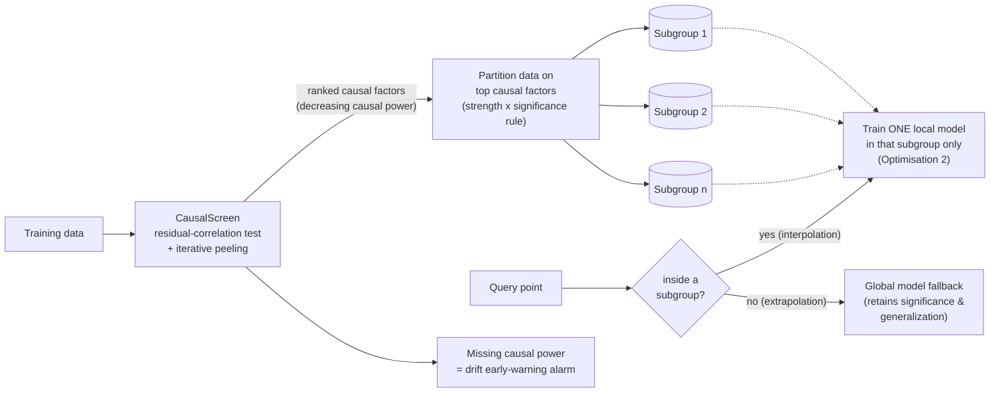

# causalscreen (-> pip install causalscreen)

Residual-correlation causal screening with iterative peeling, causal-factor
partitioning with inference-time local models, and a missing-causal-power
drift alarm.

Companion code for: **R. K. Mandal, "Residual-Correlation Causal Screening with
Localized Supervised Modeling: A Practical Framework for Confounder
Identification, Error Reduction, and Drift Early-Warning"** (working paper,
2026; research 2022–present). Paper PDF in `/paper` · Preprint: https://papers.ssrn.com/sol3/papers.cfm?abstract_id=7135078

## What it does

Supervised models fail in deployment because they lean on **confounded
proxies** — features whose correlation with the target is inherited from other
variables. `causalscreen`:

1. **Screens** every candidate feature via the two-regression residual
   construction (Frisch–Waugh–Lovell partial correlation): regress `y` on the
   other features, regress `x_j` on the other features, correlate the
   residuals. High residual correlation = genuine independent effect.
2. **Peels** iteratively: each discovered factor's contribution is stripped
   out of the response before the next round, so its influence cannot re-enter
   the screen through the variables it confounds.
3. **Ranks** features by causal power and reports the **missing causal
   power** — the share of response variance the discovered factors cannot
   explain — a deployable early-warning statistic for data/model drift.
4. **Exploits** the ranking: `PartitionedRegressor` partitions data on top
   causal factors and trains one small local model per query at inference
   time (interpolation), falling back to the global model out of support
   (extrapolation) — so the error reduction of local modeling never costs
   out-of-sample generalization.

## Quick result (synthetic ground truth, `examples/demo.py`)

| feature | naive \|corr\| with y | causal screen verdict |
|---|---|---|
| x1 (true cause) | 0.92 | **ranked** (power 0.78) |
| x2 (confounded proxy of x1) | 0.87 | **rejected** |
| x3 (noise) | 0.01 | rejected |
| x4 (true cause, weak) | 0.33 | **ranked** (power 0.83) |

Missing causal power: 5.1% — the exact noise floor of the generating process.
Partitioned local modeling: **99.0% out-of-sample MSE reduction** vs. a global
model on regime-structured data.

## Install & use

```bash
pip install -e .
python examples/demo.py
pytest tests/
```

```python
from causalscreen import CausalScreen, PartitionedRegressor
res = CausalScreen(alpha=0.05).fit(X, y, feature_names)
res.ranking            # features in decreasing causal power
res.causal_power       # partial correlation at selection round
res.missing_causal_power  # drift-alarm statistic

pr = PartitionedRegressor(partition_features=res.ranking[:2], min_cell=50)
pr.fit(X, y, feature_names)
pr.predict(X_new)      # local model in-support, global model out-of-support
```

## Assumptions (stated plainly)

Stationary cross-sectional data · causal sufficiency (all relevant variables
observed) · no reverse causation · features measured before the response.
The screen addresses the *confounding* component of causal analysis; it does
not prove causality in full generality. See paper §3, §7.

## Deployed results

Layered over Random Forest, OLS and Prophet models in commercial deployments
(credit risk, segmentation, forecasting), the framework reduced out-of-sample
error by 65–85%. Client data is not releasable; this repo's synthetic
benchmarks are the reproducible counterpart. DoWhy/EconML comparison suite:
in progress.

## Performance (v0.2.0)

Screening uses a single precision-matrix inversion per round (FWL-equivalent,
with an exact residual-regression fallback for ill-conditioned designs) —
~77x faster than the reference implementation at n=5000, p=40. Partitioned
prediction indexes cells at fit time and caches local models — ~409x faster
on batch prediction (20k train / 5k queries). Equivalence to the reference
implementation is enforced in the test suite to ~1e-8 (38 tests; reference
implementation vendored in `tests/`).

## License

MIT

## Pipeline


